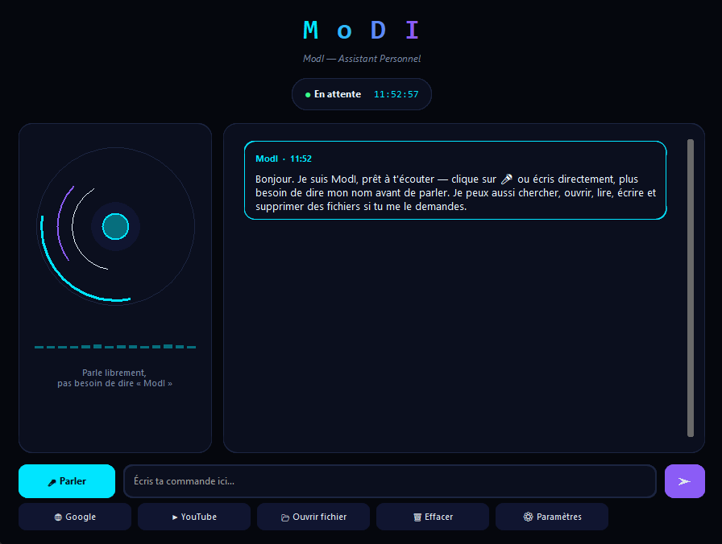

# ModI — Assistant Personnel

Assistant vocal et textuel personnel en Python, avec une interface futuriste
(customtkinter) et un cerveau IA basé sur les modèles hébergés par
[Hugging Face](https://huggingface.co) (Inference Providers).



## Fonctionnalités

- 🎙️ **Vocal ou texte** — parle ou écris directement, plus besoin de dire « ModI » avant chaque phrase.
- 🧠 **Cerveau IA** — les questions sont envoyées à un modèle de langage via l'API Hugging Face.
- 📁 **Accès aux fichiers** — ModI peut chercher, ouvrir, lire, écrire et supprimer des fichiers quand tu le lui demandes en langage naturel (avec confirmation avant toute action destructive).
- 🎨 **Interface futuriste** — orbe holographique animé, égaliseur, bulles de conversation, thème sombre cyan/violet.

## Structure du projet

```
.
├── main.py                      # point d'entrée (python main.py)
├── gui.py                       # interface graphique principale
├── widgets.py                   # orbe HUD, égaliseur, titre en dégradé
├── brain.py                     # appels à l'API Hugging Face + outils
├── file_tools.py                # actions fichiers (chercher/ouvrir/lire/écrire/supprimer)
├── config.py                    # chargement/sauvegarde de la configuration
├── theme.py                     # couleurs et polices
├── requirements.txt
├── modi_config.example.json   # exemple de configuration (sans clé)
└── .gitignore
```

## Installation

```bash
git clone https://github.com/mohammedibra225-stack/MoDI-assistant.git
cd MoDI-assistant
pip install -r requirements.txt
python main.py
```

## Configuration (clé Hugging Face)

1. Crée un compte sur [huggingface.co](https://huggingface.co)
2. Va dans **Settings → Access Tokens → New token**, type **Fine-grained**, et active la permission **Make calls to Inference Providers**.
3. Lance l'application, ouvre **⚙ Paramètres**, colle ta clé, clique sur **🔌 Tester la connexion**, puis **💾 Enregistrer**.

Ta clé est sauvegardée localement dans `modi_config.json`, qui est exclu du
dépôt Git (`.gitignore`) — elle ne sera donc jamais publiée sur GitHub.

> ⚠️ Ne mets jamais ta clé API directement dans le code source.

## Outils fichiers disponibles

| Tu demandes... | ModI fait... |
|---|---|
| "trouve mon fichier facture.pdf" | recherche dans ton dossier personnel |
| "ouvre le fichier rapport.docx" | l'ouvre avec l'application par défaut |
| "lis le fichier notes.txt" | lit son contenu texte |
| "écris X dans le fichier Y" | crée ou modifie un fichier texte |
| "supprime le fichier Z" | demande confirmation, puis déplace le fichier dans une corbeille locale récupérable (`~/.modi_corbeille`) |

